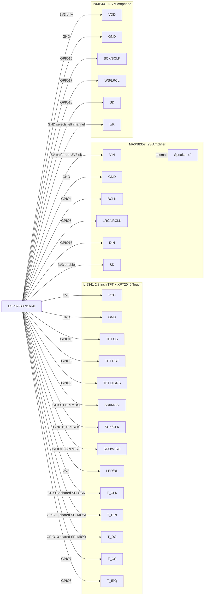

# ESP32-S3 Wisp Touch Wiring Diagram

This wiring is for:

- ESP32-S3 N16R8 USB-C development board
- ILI9341 2.8-inch SPI TFT LCD touch display
- XPT2046 resistive touch controller on the display module
- MAX98357 I2S amplifier
- INMP441 I2S microphone

Use a shared ground between every module.

## Visual Diagram

## Pin Table

### ILI9341 TFT Display

| Display Pin | ESP32-S3 Pin | Notes |
| --- | ---: | --- |
| VCC | 3V3 first, 5V if USB drops | Many 2.8-inch PCB modules have a regulator and may need 5V for stable backlight power |
| GND | GND | Shared ground |
| CS / TFT_CS | GPIO10 | TFT chip select |
| RESET / RST | 3V3 | Keep reset high during first bring-up |
| DC / RS | GPIO9 | TFT data/command |
| SDI / MOSI | GPIO11 | Shared SPI MOSI |
| SCK / CLK | GPIO12 | Shared SPI clock |
| SDO / MISO | GPIO13 | Shared SPI MISO |
| LED / BL | leave disconnected for first boot, then 3V3 | If the board disappears from USB, BL current is too high for the ESP32 3V3 rail |

### XPT2046 Touch Pins

| Touch Pin | ESP32-S3 Pin | Notes |
| --- | ---: | --- |
| T_CLK | GPIO12 | Shared SPI clock |
| T_DIN | GPIO11 | Shared SPI MOSI |
| T_DO | GPIO13 | Shared SPI MISO |
| T_CS | GPIO7 | Touch chip select |
| T_IRQ | GPIO6 | Touch interrupt |

### MAX98357 I2S Amplifier

| MAX98357 Pin | ESP32-S3 Pin | Notes |
| --- | ---: | --- |
| VIN | 5V or 3V3 | 5V gives louder output |
| GND | GND | Shared ground |
| BCLK | GPIO4 | I2S bit clock |
| LRC / LRCLK | GPIO5 | I2S word select |
| DIN | GPIO16 | I2S audio data |
| SD | 3V3 | Keeps amplifier enabled |
| Speaker +/- | Speaker | Do not connect speaker to ESP32 pins |

### INMP441 I2S Microphone

| INMP441 Pin | ESP32-S3 Pin | Notes |
| --- | ---: | --- |
| VDD | 3V3 | Do not use 5V |
| GND | GND | Shared ground |
| SCK / BCLK | GPIO15 | I2S bit clock |
| WS / LRCL | GPIO17 | I2S word select |
| SD | GPIO18 | I2S mic data |
| L/R | GND | Selects left channel |

## Bench Checklist

1. Wire all GND pins together first.
2. For first display boot, wire only the TFT display pins, not touch/audio/mic.
3. Leave `LED/BL` disconnected for the first boot test. The screen will be dim,
   but it should no longer be able to brown out the ESP32 3.3V rail.
4. Wire the TFT SPI bus: `GPIO11`, `GPIO12`, `GPIO13`.
5. Wire TFT control pins: `GPIO10`, `GPIO9`, and tie `RESET/RST` to `3V3`.
6. Power from USB-C and confirm the ESP32 still appears as `/dev/cu.usbmodem...`.
7. Upload the firmware.
8. If the display initializes, connect `LED/BL` to `3V3`.
9. Add touch pins, then audio, then mic.
10. Open the Wisp `Pair` tab and pair with NodeSparkHub.

## If The ESP32 Disappears When The Display Is Plugged In

This means the display module is interfering electrically before firmware has a
chance to run. Try this order:

1. Disconnect `LED/BL`.
2. Keep `GND` shared.
3. If the board still disappears, move TFT `VCC` from `3V3` to `5V` only if your
   module is marked `5V/3.3V` or has an onboard regulator.
4. Do not connect touch, amp, or mic until the TFT alone boots.
5. Do not use ESP32-S3 `GPIO19` or `GPIO20`; those are USB pins on many boards.

## Safety Notes

- INMP441 must use `3V3`, not `5V`.
- Most ILI9341 modules accept `3V3` logic. Do not feed 5V into signal pins.
- If your TFT module says VCC is 5V-only, power VCC from `5V` but keep all SPI
  and control signals on ESP32 3.3V logic.
- The speaker connects only to the MAX98357 speaker output, never directly to
  the ESP32-S3.
