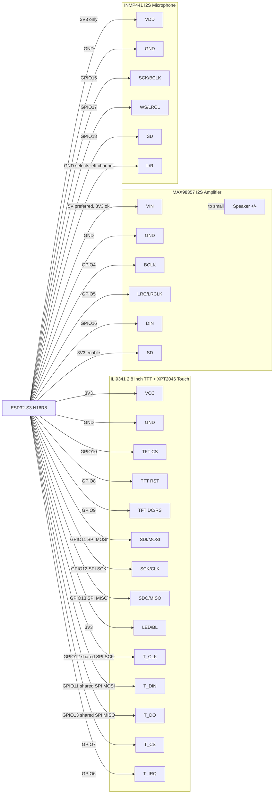

# ESP32-S3 Wisp Touch Wiring Diagram

This wiring is for:

- ESP32-S3 N16R8 USB-C development board
- ILI9341 2.8-inch SPI TFT LCD touch display
- XPT2046 resistive touch controller on the display module
- MAX98357 I2S amplifier
- INMP441 I2S microphone

Use a shared ground between every module.

## Visual Diagram

## Pin Table

### ILI9341 TFT Display

| Display Pin | ESP32-S3 Pin | Notes |
| --- | ---: | --- |
| VCC | 3V3 | Start with 3.3V power |
| GND | GND | Shared ground |
| CS / TFT_CS | GPIO10 | TFT chip select |
| RESET / RST | GPIO8 | TFT reset |
| DC / RS | GPIO9 | TFT data/command |
| SDI / MOSI | GPIO11 | Shared SPI MOSI |
| SCK / CLK | GPIO12 | Shared SPI clock |
| SDO / MISO | GPIO13 | Shared SPI MISO |
| LED / BL | 3V3 | Backlight always on |

### XPT2046 Touch Pins

| Touch Pin | ESP32-S3 Pin | Notes |
| --- | ---: | --- |
| T_CLK | GPIO12 | Shared SPI clock |
| T_DIN | GPIO11 | Shared SPI MOSI |
| T_DO | GPIO13 | Shared SPI MISO |
| T_CS | GPIO7 | Touch chip select |
| T_IRQ | GPIO6 | Touch interrupt |

### MAX98357 I2S Amplifier

| MAX98357 Pin | ESP32-S3 Pin | Notes |
| --- | ---: | --- |
| VIN | 5V or 3V3 | 5V gives louder output |
| GND | GND | Shared ground |
| BCLK | GPIO4 | I2S bit clock |
| LRC / LRCLK | GPIO5 | I2S word select |
| DIN | GPIO16 | I2S audio data |
| SD | 3V3 | Keeps amplifier enabled |
| Speaker +/- | Speaker | Do not connect speaker to ESP32 pins |

### INMP441 I2S Microphone

| INMP441 Pin | ESP32-S3 Pin | Notes |
| --- | ---: | --- |
| VDD | 3V3 | Do not use 5V |
| GND | GND | Shared ground |
| SCK / BCLK | GPIO15 | I2S bit clock |
| WS / LRCL | GPIO17 | I2S word select |
| SD | GPIO18 | I2S mic data |
| L/R | GND | Selects left channel |

## Bench Checklist

1. Wire all GND pins together first.
2. Wire the TFT and touch SPI bus: `GPIO11`, `GPIO12`, `GPIO13`.
3. Give the TFT and touch separate chip selects: TFT `GPIO10`, touch `GPIO7`.
4. Wire the MAX98357 and speaker.
5. Wire the INMP441 microphone.
6. Power from USB-C.
7. Upload the firmware.
8. Open the Wisp `Pair` tab and pair with NodeSparkHub.

## Safety Notes

- INMP441 must use `3V3`, not `5V`.
- Most ILI9341 modules accept `3V3` logic. Do not feed 5V into signal pins.
- If your TFT module says VCC is 5V-only, power VCC from `5V` but keep all SPI
  and control signals on ESP32 3.3V logic.
- The speaker connects only to the MAX98357 speaker output, never directly to
  the ESP32-S3.

